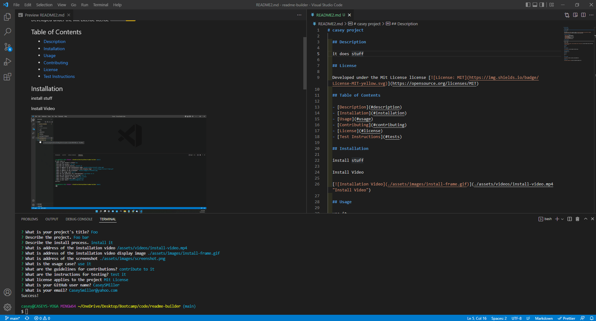

# casey project

  ## Description
  
  it does stuff
  
  ## License
  
  Developed under the Mit License license 
  
  ## Table of Contents
  
  - [Description](#description)
  - [Installation](#installation)
  - [Usage](#usage)
  - [Contributing](#contributing)
  - [License](#license)
  - [Test Instructions](#tests)
  
  ## Installation
  
  install stuff
  
  Install Video
  
  
  ## Usage
  
  use it
  
  ## Screenshot
  
  
  
  ## Contributing
  
  contribute to it
  
  ## Tests
  
  test it
  
  ---
  
  ## My GitHub
  
  [CaseySMiller](https://github.com/CaseySMiller)
  
  ## Email me
  
  [CaseySMiller@yahoo.com](mailto:CaseySMiller@yahoo.com)

