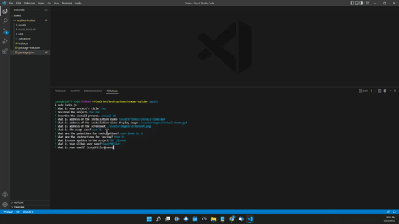

# README Builder

  ## Description
  
  Module 9, Node.js Challenge: Professional README Generator, due on 5/27/2022

  This is a command line application using node.js and the Inquirer module to generate a professional looking README.md file such as this one that can be used in your project repos.
  
  ## License
  
  Developed under Mit License 
  
  ## Table of Contents
  
  - [Description](#description)
  - [Installation](#installation)
  - [Usage](#usage)
  - [Contributing](#contributing)
  - [License](#license)
  - [Test Instructions](#tests)
  
  ## Installation
  
  1. Open VScode where you want to install the app
  2. Enter "git clone git@github.com:CaseySMiller/readme-builder.git" command in terminal
  3. After the files are cloned enter "cd readme-builder" command in terminal
  4. Enter "npm init -y" command in terminal
  5. Enter "npm install inquirer" command in terminal
  6. To launch the application type "node index.js"
  
  [Install and Usage Video](./assets/videos/install-video.mp4 "Install and Usage Video")
  
  
  
  ## Usage
  
  - Enter the command "node index.js" in terminal to launch and answer all of the questions posed in the terminal
  - When asked for location of video provide the local relative path or the web address
  - When asked for the video image supply the address for a video placeholder image to dislay in the README file (.gifs work well)
  - After all questions are answered the application will generate a professional looking README.md file in the ./output/ folder
  - Copy the new README.md file from output in to your project's repo
  
  ## Screenshot
  
  
  
  ## Contributing
  
  For suggestions or to contribute to this application send an email to the link below.
  
  ## Test Instructions
  
  Install and test using the above information
  
  ---
  
  ## My GitHub
  
  [CaseySMiller](https://github.com/CaseySMiller)
  
  ## Email me
  
  [CaseySMiller@yahoo.com](mailto:CaseySMiller@yahoo.com)

